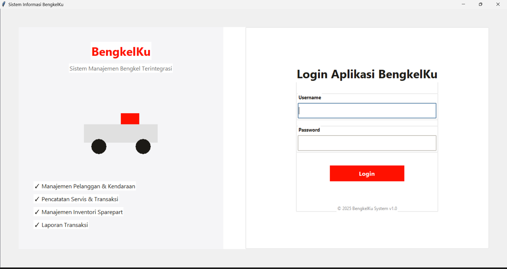
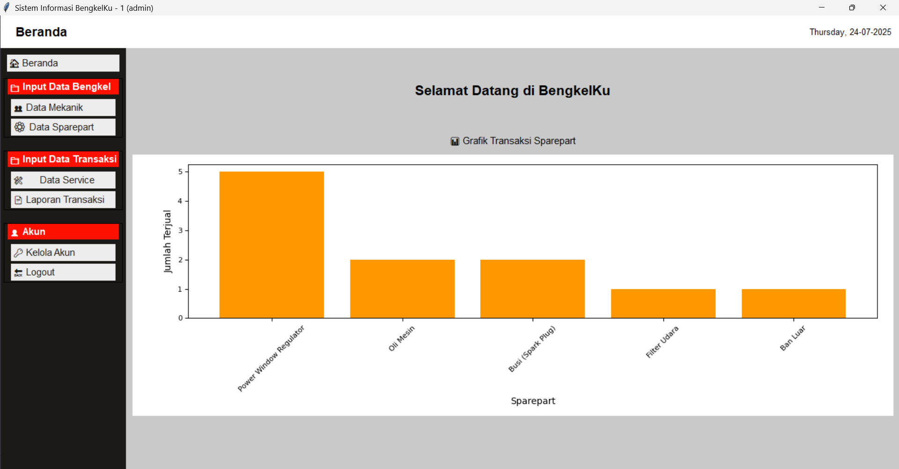
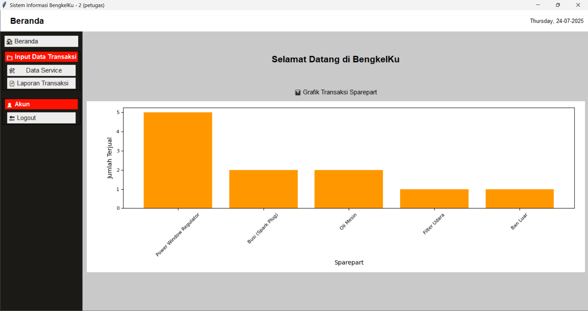
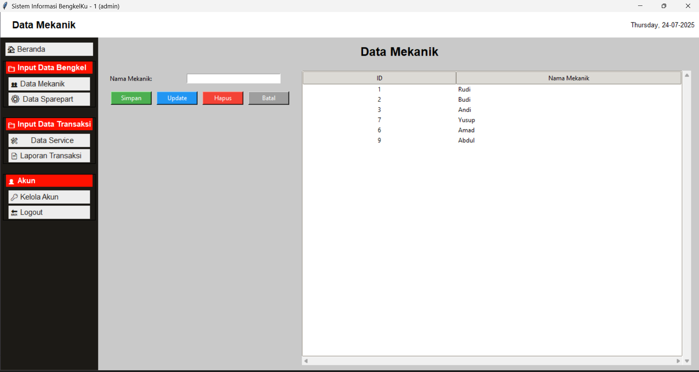
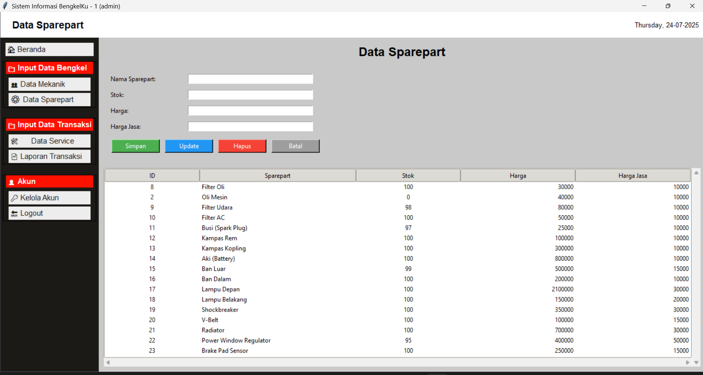
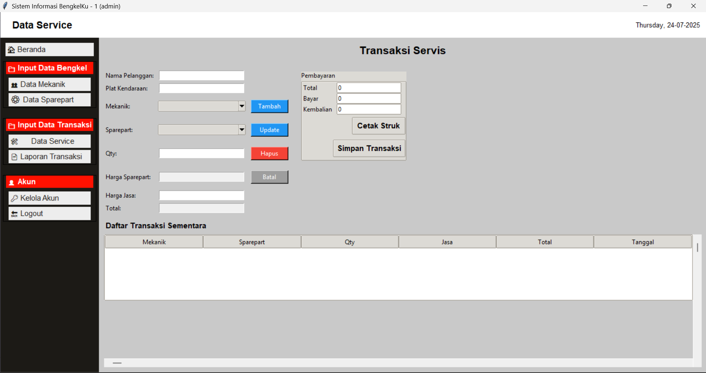
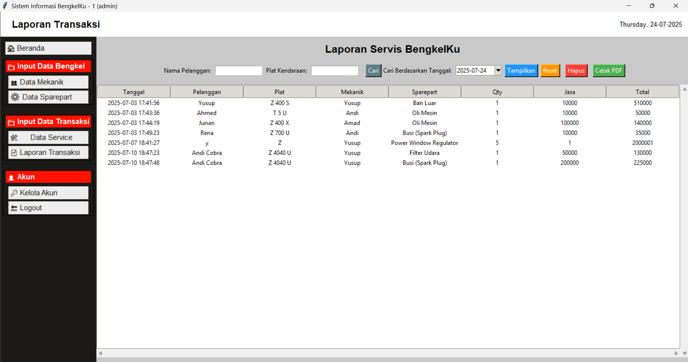
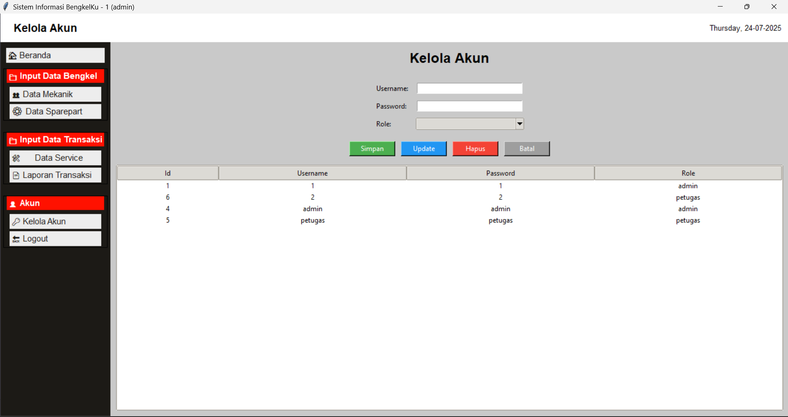

# 📌 Sistem Informasi BengkelKu
Sistem Informasi BengkelKu adalah aplikasi desktop berbasis Python (Tkinter) yang dirancang untuk membantu pengelolaan data bengkel kendaraan, termasuk data mekanik, sparepart, transaksi service, dan laporan penjualan.

## ✨ Fitur Utama
✅ Login Multiuser – Tersedia role Admin dan Petugas
✅ Manajemen Data Bengkel

- Input Data Mekanik

- Input & Kelola Data Sparepart
✅ Manajemen Transaksi

- Data Service Kendaraan

- Laporan Transaksi Sparepart & Service
✅ Manajemen Akun – Tambah, edit, dan hapus akun
✅ Grafik Penjualan Sparepart – Visualisasi penjualan dengan Matplotlib
✅ UI Sederhana & Mudah Digunakan

# 🖼️ Tampilan Aplikasi
- 🔹 Tampilan Admin

- 🔹 Tampilan Petugas

# 🛠️ Teknologi yang Digunakan
- Python 3.x
- Tkinter (GUI)
- SQLite3 (Database lokal)
- Matplotlib (Grafik transaksi)
# Tampilan Antarmuka

